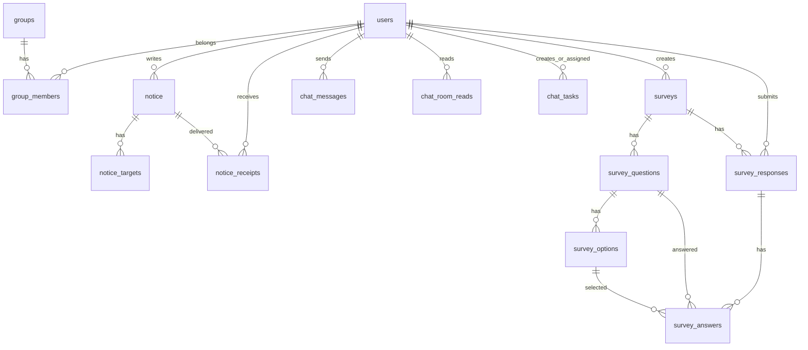

# Alrimjang

조직 공지/채팅/할 일/설문을 통합한 Spring Boot 기반 협업 시스템입니다.

## 주요 기능
- 공지: 대상 지정 배포, 수신/읽음 추적, 관리자 숨김/복구
- 채팅: 1:1/그룹 채팅, 읽지 않은 메시지 카운트, 방별 접근 제어
- 채팅 할 일: 담당자 지정, 마감일, 완료/확인 상태 전이
- 설문: 관리자 생성, 기간 제어, 객관식/주관식 응답, 결과 집계
- 권한: ADMIN/USER + 공지작성/알림작성 세부 권한

## 기술 스택
- Java 17, Spring Boot 3.2.2
- Spring Security, WebSocket(STOMP)
- Thymeleaf, MyBatis
- PostgreSQL, Flyway
- Maven, JUnit5, Mockito

## 내가 구현한 핵심 3가지
1. 채팅방 접근 제어 강제
- DM/그룹방 규칙을 `ChatRoomAccessService`로 통합하고, 메시지 조회/전송/읽음 API에서 모두 검증하도록 적용

2. 채팅 할 일 상태 전이 규칙
- `PENDING -> DONE -> CONFIRMED` 상태 흐름을 서비스 레이어에서 강제
- 담당자만 완료 가능, 생성자만 확인 가능하도록 권한 분리

3. 설문 응답 무결성 검증
- 기간(시작/마감), 필수문항, 단일선택 개수, 유효한 옵션 ID 여부, 중복 응답을 서비스에서 검증
- 집계 화면에서 객관식 투표수/비율, 주관식 최근 응답 조회 제공

## 아키텍처

```text
[Browser]
   |  HTTP / WebSocket
   v
[Controller]
   |  Service 호출
   v
[Service]
   |  비즈니스 규칙/권한 검증/트랜잭션
   v
[MyBatis Mapper]
   |  SQL
   v
[PostgreSQL]
```

### 레이어 책임
- `controller`: 요청/응답, 인증 사용자 식별
- `service`: 도메인 규칙, 권한/접근 제어, 상태 전이
- `mapper`: SQL 조회/변경
- `resources/db/migration`: 버전 기반 스키마 관리(Flyway)

## 권한 정책
- `ROLE_ADMIN`: `/admin/**` 전체
- `ROLE_NOTICE_WRITER` 또는 `ROLE_ADMIN`: 공지 작성/수정/삭제
- `ROLE_NOTIFICATION_WRITER` 또는 `ROLE_ADMIN`: 알림 작성
- 채팅방 접근:
1. DM(`dm__a__b`): 방 토큰에 본인 username 토큰이 포함되어야 함
2. 그룹방(`grp__{groupId}`): `group_members`에 사용자 소속 + 그룹 `type='CHAT'`

## ERD (실제 테이블 기준)



## DB 마이그레이션
- Flyway 사용 (`src/main/resources/db/migration`)
- 초기 스키마: `V1__init_schema.sql`
- 기존 DB에 히스토리 테이블이 없으면 `baseline-on-migrate`로 베이스라인 처리
- 운영 런북: [`docs/DB_MIGRATION_RUNBOOK.md`](/mnt/d/ssh/allimjang/docs/DB_MIGRATION_RUNBOOK.md)
- 사전 점검 SQL: [`scripts/db-preflight-check.sql`](/mnt/d/ssh/allimjang/scripts/db-preflight-check.sql)

## 성능/트래픽 기준
- 메시지 조회 API는 최대 `200`건으로 상한 처리 (`getRecent` limit clamp)
- 안읽음 카운트/최근순 조회를 위해 채팅/설문/공지 핵심 컬럼에 인덱스 구성
- 채팅방 목록은 마지막 메시지/과제 기준으로 정렬하고, 읽음 시각(`chat_room_reads`) 기반으로 안읽음 계산
- 현재 단계는 기능/정합성 중심이며, 대규모 부하테스트(예: k6/JMeter) 수치는 미포함

## 실행 방법

### 1) 환경 변수 준비
`.env.example`을 기준으로 환경 변수 설정:

```env
DB_URL=jdbc:postgresql://localhost:5432/alrimjang
DB_USERNAME=alrimjang_app
DB_PASSWORD=change_me
PORT=9090
SPRING_PROFILES_ACTIVE=dev
```

### 2) 실행
```bash
mvn spring-boot:run
```

## 테스트
```bash
mvn test
```

## 트러블슈팅 기록
1. `can_post_notification` 컬럼 누락으로 관리자 페이지 500
- 조치: users 컬럼 추가 + Flyway 마이그레이션 반영

2. 설문 Mapper XML 파싱 오류
- 원인: XML 특수문자/태그 불일치
- 조치: Mapper XML 구조 정리, 배포 전 부팅 검증 필수화

3. 채팅방 접근 범위 이슈
- 원인: 방 ID만으로 진입 가능한 UI 흐름
- 조치: 서비스 레이어에서 `ChatRoomAccessService` 강제 검증

## 포트폴리오 포인트
- 단순 CRUD가 아닌 권한/접근제어/상태전이/실시간 처리를 한 프로젝트
- 기능 확장 시 DB 스키마를 Flyway로 추적 가능
- 핵심 정책을 서비스 테스트로 회귀 검증 가능
