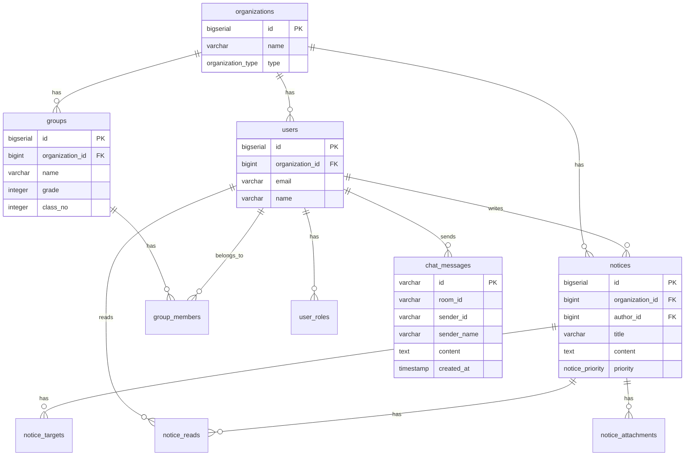

# 스마트 알림장 (Alrimjang)

> 교사와 학생, 학부모를 하나로 잇는 디지털 소통 플랫폼

---

## 1. 프로젝트 개요

**목적**: 기존 종이 알림장이나 단체 채팅방의 불편함을 해소하고, 공지 사항 전달 및 확인 여부를 체계적으로 관리합니다.

**주요 타겟**: 학급 운영 효율화를 원하는 교사, 자녀의 공지를 놓치고 싶지 않은 학부모.

**핵심 가치**: 정보 전달의 정확성 · 열람 확인의 투명성 · 데이터 중심의 학급 관리.

---

## 2. 기술 스택

| 구분 | 기술 | 상세 |
|------|------|------|
| **Language** | Java 17 | — |
| **Framework** | Spring Boot 3.2.2 | Spring Security, WebSocket (STOMP) |
| **Template** | Thymeleaf | + Thymeleaf Spring Security 6 |
| **Database** | PostgreSQL (Neon) | 클라우드 Serverless DB |
| **ORM** | MyBatis 3.0.3 | XML Mapper 기반 |
| **Frontend** | Bootstrap 5, jQuery | 정적 리소스 (`style.css`, `common.js`) |
| **Build** | Maven | `spring-boot-maven-plugin` |
| **기타** | Lombok, DevTools | — |

---

## 3. 핵심 기능

### 📢 공지사항 관리
- 공지 작성(CRUD) · 수정 · 삭제 및 숨김/해제
- **대상 지정 배포**: 전체, 역할별(`ROLE_USER`, `ROLE_ADMIN`), 그룹별 선택 배포
- **열람 확인**: 수신자별 읽음/안읽음 상태 추적
- 키워드 + 유형별 검색 · 페이징 처리

### 💬 실시간 채팅
- WebSocket (STOMP) 기반 1:1 DM 채팅
- 사용자 온라인/오프라인 상태 실시간 추적
- 안읽은 메시지 카운트 · 읽음 처리

### 🔐 인증 및 권한
- Spring Security 세션 기반 인증
- 회원가입 / 로그인 (BCrypt 암호화)
- 역할 기반 접근 제어 (ADMIN / USER)

### 📊 대시보드
- 로그인 후 메인 화면으로 대시보드 표시
- 서버 정보 API (`/api/info`)

---

## 4. 프로젝트 구조

```
src/main/
├── java/com/alrimjang/
│   ├── config/                          # 설정
│   │   ├── MyBatisConfig.java
│   │   ├── SecurityConfig.java
│   │   ├── SecurityActivityListener.java
│   │   └── WebSocketConfig.java
│   ├── controller/                      # HTTP / WebSocket 요청 처리
│   │   ├── HomeController.java          # 메인 페이지, 대시보드, 서버 정보 API
│   │   ├── AuthController.java          # 로그인
│   │   ├── RegisterController.java      # 회원가입
│   │   ├── NoticeController.java        # 공지 CRUD (MVC)
│   │   ├── NoticeAudienceApiController.java   # 공지 대상/배포/읽음 API
│   │   ├── UserNoticeReceiptApiController.java # 내 수신 공지 API
│   │   ├── ChatController.java          # 채팅 (REST + WebSocket)
│   │   └── GlobalExceptionHandler.java  # 전역 예외 처리
│   ├── service/                         # 비즈니스 로직
│   │   ├── NoticeService.java / impl/
│   │   ├── NoticeAudienceService.java / impl/
│   │   ├── UserService.java / impl/
│   │   ├── ChatService.java / impl/
│   │   ├── CustomUserDetailsService.java
│   │   └── ActiveUserTracker.java
│   ├── mapper/                          # MyBatis 인터페이스
│   │   ├── NoticeMapper.java
│   │   ├── NoticeAudienceMapper.java
│   │   ├── UserMapper.java
│   │   ├── GroupMapper.java
│   │   ├── ChatMessageMapper.java
│   │   └── ChatReadMapper.java
│   ├── model/                           # Entity + DTO
│   │   ├── entity/                      # DB 엔티티 (Notice, Users, Group 등)
│   │   ├── common/                      # PageRequest, PageResult
│   │   ├── RegisterRequest.java
│   │   ├── ChatSendRequest.java
│   │   └── NoticeTargetRequest.java
│   └── AlrimjangApplication.java
├── resources/
│   ├── mapper/                          # MyBatis SQL XML
│   │   ├── NoticeMapper.xml
│   │   ├── NoticeAudienceMapper.xml
│   │   ├── UserMapper.xml
│   │   ├── GroupMapper.xml
│   │   ├── ChatMessageMapper.xml
│   │   └── ChatReadMapper.xml
│   ├── templates/                       # Thymeleaf 뷰
│   │   ├── index.html                   # 랜딩 페이지
│   │   ├── login.html / register.html
│   │   ├── dashboard.html
│   │   ├── notices/ (list, detail, form)
│   │   ├── chat/room.html
│   │   └── fragments/ (layout, pagination, search, vendor)
│   ├── static/css/style.css
│   ├── static/js/common.js
│   ├── schema.sql                       # 채팅 테이블 초기화 DDL
│   └── application.yml
```

---

## 5. API 엔드포인트

### 페이지 (MVC)

| Method | URL | 설명 |
|--------|-----|------|
| GET | `/` | 랜딩 페이지 (미인증 시) / 대시보드 리다이렉트 |
| GET | `/login` | 로그인 |
| GET/POST | `/register` | 회원가입 |
| GET | `/dashboard` | 대시보드 |
| GET | `/notices` | 공지 목록 (검색/페이징) |
| POST | `/notices` | 공지 작성 |
| GET | `/notices/{id}` | 공지 상세 |
| GET | `/notices/new` | 공지 작성 폼 |
| GET | `/notices/{id}/edit` | 공지 수정 폼 |
| POST | `/notices/{id}` | 공지 수정 |
| POST | `/notices/{id}/delete` | 공지 삭제 |
| POST | `/notices/{id}/hide` | 공지 숨김 |
| POST | `/notices/{id}/unhide` | 공지 숨김 해제 |
| GET | `/chat` | 채팅 페이지 |

### REST API

| Method | URL | 설명 |
|--------|-----|------|
| GET | `/api/info` | 서버 정보 |
| POST | `/api/notices/{id}/targets` | 공지 대상 설정 |
| POST | `/api/notices/{id}/deliver` | 공지 배포 |
| POST | `/api/notices/{id}/read` | 공지 읽음 처리 |
| GET | `/api/users/me/receipts` | 내 수신 공지 목록 |
| GET | `/api/chat/rooms/{roomId}/messages` | 채팅 메시지 조회 |
| GET | `/api/chat/rooms/{roomId}/unread-count` | 안읽은 메시지 수 |
| POST | `/api/chat/rooms/{roomId}/read` | 채팅 읽음 처리 |
| GET | `/api/chat/members` | 채팅 멤버 목록 |
| GET | `/api/chat/direct-room/{username}` | 1:1 DM 방 조회 |

### WebSocket

| Destination | 설명 |
|-------------|------|
| `/app/chat/send` | 메시지 전송 |
| `/topic/chat.{roomId}` | 메시지 수신 (구독) |

---

## 6. 설치 및 실행

### 사전 준비

- Java 17+
- PostgreSQL (로컬 또는 Neon 클라우드)
- Maven

### 환경 변수 설정

프로젝트 루트의 `.env.example`을 복사하여 `.env` 파일을 생성하고, 실제 값을 입력합니다.

```properties
DB_NAME=alrimjang
DB_USERNAME=postgres
DB_PASSWORD=your_password_here
SPRING_PROFILES_ACTIVE=dev
```

### 실행

```bash
# 리포지토리 클론
git clone https://github.com/ssuukko/alrimjang.git
cd alrimjang

# 빌드 및 실행
./mvnw spring-boot:run
```

실행 후 `http://localhost:9090` 에서 접속할 수 있습니다.

---

## 7. DB 설계 (ERD)

### 주요 테이블

| 테이블 | 설명 |
|--------|------|
| `organizations` | 조직 (학교/회사) |
| `groups` | 그룹 (학급/팀) |
| `group_members` | 그룹 소속 관계 |
| `users` | 사용자 |
| `user_roles` | 사용자 역할 |
| `notices` | 공지사항 |
| `notice_targets` | 공지 대상 조건 |
| `notice_reads` / `notice_receipts` | 공지 수신 및 읽음 기록 |
| `notice_attachments` | 공지 첨부파일 |
| `chat_messages` | 채팅 메시지 |
| `chat_room_reads` | 채팅 읽음 기록 |

### ERD 다이어그램



---

## 8. 커밋 컨벤션

| 타입 | 설명 |
|------|------|
| `init` | 초기 설정 |
| `feat` | 기능 추가 |
| `fix` | 버그 수정 |
| `refactor` | 리팩토링 |
| `docs` | 문서 수정 |

---

## 9. 개발 환경

- **IDE**: IntelliJ IDEA
- **Database**: PostgreSQL (Neon Cloud)
- **Version Control**: Git / GitHub
- **Port**: `9090`

---

## License

This project is licensed under the MIT License.

---

## Author

**ssuukko** — [GitHub Profile](https://github.com/ssuukko)
